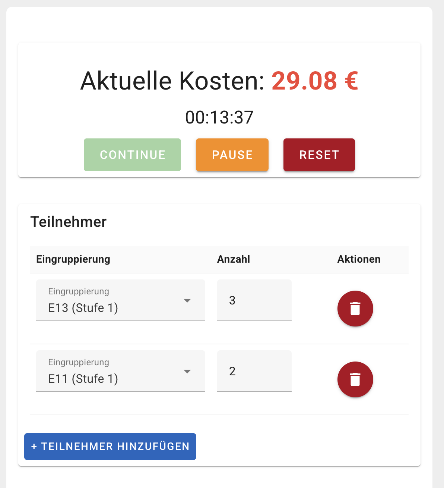

# Meeting Clock


Meeting Clock is a fun project to track the costs of a meeting that could have been an email.

</img>

The included pay grades are for the public service and civil servants in Bavaria, Germany:
- TV-L BY
- Besoldungsgruppen BY: A, B, W, R, AW

-----

# Technical Details

## Project Template

This project uses Vue.js (with Vite and Pinia) and the framework Vuetify:

```text
✔ Project name: meeting-clock
✔ Which preset would you like to install? › Recommended (Everything from Default. Adds auto importing, layouts & pinia)
✔ Use TypeScript? No
✔ Would you like to install dependencies with yarn, npm, pnpm, or bun? › yarn
✔ Install Dependencies? Yes
```

## 💿 Install

This project uses [``yarn``](https://yarnpkg.com/getting-started) as package manager:

```sh
yarn install
```

After completing the installation, your environment is ready for Vuetify development.

## 💡 Usage

This section covers how to start the development server and build your project for production.

### Starting the Development Server

To start the development server with hot-reload, run the following command. The server will be accessible at [http://localhost:3000](http://localhost:3000):

```bash
yarn dev
```

### Building for Production

This project uses GitHub Actions to build the latest tagged commit and publish it on GitHub pages.

To build this project for production yourself, use:
```bash
yarn build
```

Once the build process is completed, your application will be ready for deployment in a production environment.
